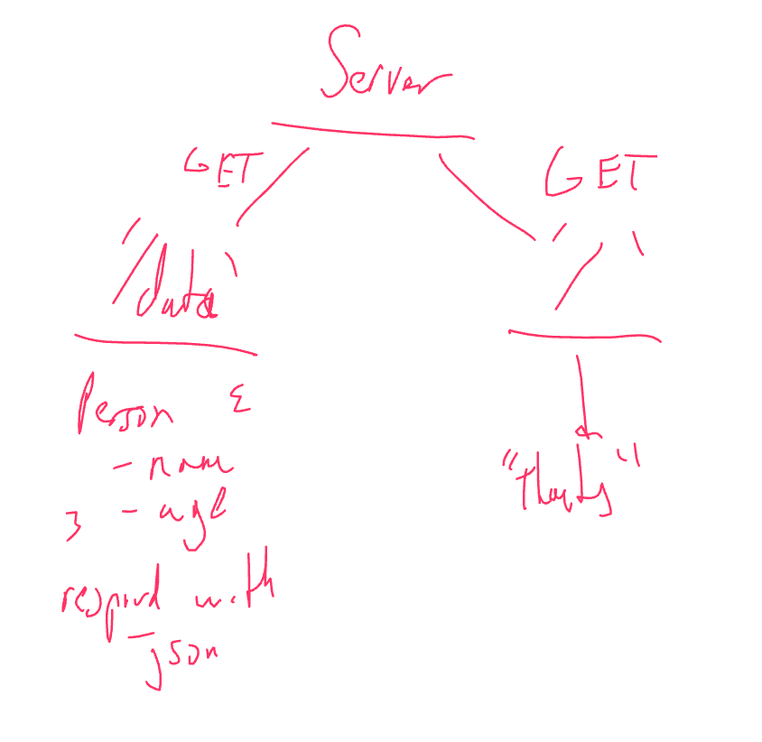

# class-01-demo

Simple express server with one route that responds with a message.

## Routes

### /

* No parameters
* JSON response: {"message":"thanks"}

### /data

* No parameter
* JSON response: Person
  * Person includes name and age.
